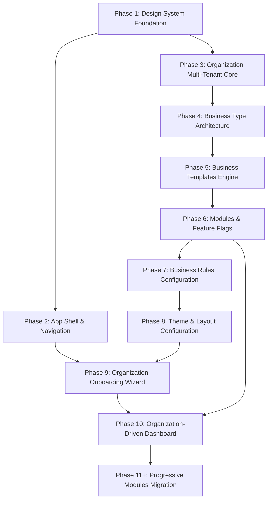

# ROADMAP: Hub MakePro (Beauty & Esthetics SaaS)

## Milestones Arquivados
- [x] **[Milestone v1.0 — Beauty Core Release](file:///z:/DevOps%20-%20FullStack/Hub%20MakePro/.planning/milestones/v1.0-ROADMAP.md)** (Concluído em 2026-09-13) — 7 Fases entregues (Auth SSR, Multi-tenant, Catálogo por Nicho, Especialistas & Comissões, Agenda Operacional & Anamnese, Agendamento Online /book/[slug] e Fechamento de Caixa).
- [x] **[Milestone v1.1 — Refinamento Operacional, Edição Dinâmica & Performance](file:///z:/DevOps%20-%20FullStack/Hub%20MakePro/.planning/milestones/v1.1-ROADMAP.md)** (Concluído em 2026-09-14) — 5 Fases entregues (Skeletons de Performance, Configurações Completas do Salão, Gestão de Horários de Especialistas, Ficha 360° de Clientes e Reagendamento com Modais na Agenda).

---

## Active Milestone: v2.0 — Lab Beauty SaaS: Organization-Driven Architecture & UI/UX Design System

---

### Phase 1: Design System Foundation
- [x] **Goal:** Estabelecer a infraestrutura visual centralizada (Design Tokens HSL, tipografia, paleta temática, elevações e componentes atômicos com 5 estados obrigatórios: default, loading, empty, error, success).
- [x] **Deliverables:** `design-system.ts`, tokens CSS, componentes base (`Button`, `Input`, `Select`, `Card`, `Badge`, `Modal`, `EmptyState`, `Alert`), acessibilidade WCAG 2.1 AA e suite de testes de componentes.
- [x] **Status:** Concluído e testado com 35/35 testes unitários aprovados.
- [x] **Dependencies:** Nenhuma (Fundação pura).

### Phase 2: Application Shell & Responsive Navigation
- [x] **Goal:** Construir o Shell moderno da aplicação com navegação responsiva (Sidebar colapsável, Header dinâmico, Bottom Bar mobile e suporte a módulos dinâmicos).
- [x] **Deliverables:** Layout principal refatorado, navegação adaptativa por permissão/módulo e seletor rápido de organização com transições suaves.
- [x] **Status:** Concluído e testado com 39/39 testes unitários aprovados (`tests/unit/app-shell.test.ts`).
- [x] **Dependencies:** Phase 1 (Design System).

### Phase 3: Organization Domain & Multi-Tenant Foundation
- [x] **Goal:** Fortalecer o isolamento de tenant no banco e no servidor, garantindo validação estrita de permissões (RBAC) e RLS inviolável.
- [x] **Deliverables:** Tabela e schema de permissões granulares (`owner`, `admin`, `specialist`, `receptionist`, `financial`), validação estrita em Server Actions e testes de isolamento entre tenants.
- [x] **Status:** Concluído e testado com 50/50 testes unitários aprovados (`tests/unit/rbac-multi-tenant.test.ts`).
- [x] **Dependencies:** Nenhuma no backend; integração com Phase 2.

### Phase 4: Business Type Architecture
- [ ] **Goal:** Modelar a taxonomia de tipos de negócio de beleza (Salão de Beleza, Lash, Make, Nails, Clínica de Estética, Barbearia) e persistência de metadados.
- [ ] **Deliverables:** Tabela/Enum `business_types`, schema tipado em TypeScript, catálogo descritivo e endpoints de consulta de metadados.
- [ ] **Dependencies:** Phase 3.

### Phase 5: Business Templates Engine
- [ ] **Goal:** Criar o motor de templates pré-configurados que injetam serviços sugeridos, estrutura de ficha de anamnese e configurações recomendadas para cada tipo de negócio.
- [ ] **Deliverables:** Arquivos de definição de templates (`templates/salon.ts`, `templates/lash.ts`, etc.), Server Action de aplicação de template na criação do tenant e validações automatizadas.
- [ ] **Dependencies:** Phase 4.

### Phase 6: Players & Feature Configuration (Modules Engine)
- [ ] **Goal:** Implementar o sistema de feature flags e ativação de módulos por organização (`appointments`, `clients`, `services`, `team`, `commissions`, `cash_flow`, `online_booking`, `inventory`).
- [ ] **Deliverables:** Tabela `organization_features`, helper de verificação de permissão de módulo `hasFeature(orgId, feature)`, middleware/guard para rotas e Server Actions.
- [ ] **Dependencies:** Phase 3, Phase 5.

### Phase 7: Business Rules Configuration
- [ ] **Goal:** Permitir que cada salão defina regras operacionais customizadas (política de cancelamento, antecedência mínima, tolerância a atrasos, intervalo de limpeza/buffer entre atendimentos e regras de comissão).
- [ ] **Deliverables:** Schema `organization_business_rules`, painel de configuração operacional e cálculo dinâmico de horários na agenda.
- [ ] **Dependencies:** Phase 3, Phase 6.

### Phase 8: Theme & Layout Configuration
- [ ] **Goal:** Oferecer personalização de identidade visual por organização (cor de destaque / accent, logotipo, banner e estilo da página pública de agendamento).
- [ ] **Deliverables:** Schema `organization_theme`, injeção dinâmica de CSS variables no App Router e painel de preview em tempo real.
- [ ] **Dependencies:** Phase 1, Phase 3.

### Phase 9: Organization Onboarding Wizard
- [ ] **Goal:** Criar um fluxo guiado interativo (Wizard) passo a passo para novos tenants selecionarem seu tipo de negócio, aplicarem o template ideal e ativarem seus módulos em menos de 2 minutos.
- [ ] **Deliverables:** Componente multi-step wizard (`/onboarding`), validação em tempo real e provisionamento automático no Supabase.
- [ ] **Dependencies:** Phase 1, Phase 2, Phase 5, Phase 6, Phase 7, Phase 8.

### Phase 10: Organization-Driven Dashboard
- [ ] **Goal:** Redesenhar a página principal do Dashboard (`/dashboard`) para ser 100% modular, exibindo apenas widgets, KPIs e atalhos correspondentes aos módulos e tipo de negócio ativos.
- [ ] **Deliverables:** Grid dinâmico de widgets, cards de métricas adaptativos e avisos contextuais por nicho.
- [ ] **Dependencies:** Phase 2, Phase 6, Phase 9.

### Phase 11+: Progressive Modules Migration (Rotas Existentes)
- [ ] **Goal:** Migrar progressivamente cada tela existente para o novo Design System, consumindo as novas regras de negócio e módulos da organização.
- [ ] **Deliverables:**
  - *Phase 11.1:* Agenda Operacional (`/appointments`) com regras de buffer e modal do novo Design System.
  - *Phase 11.2:* Ficha de Clientes (`/clients`) com campos dinâmicos por template de anamnese.
  - *Phase 11.3:* Catálogo de Serviços (`/services`) e Especialistas (`/specialists`).
  - *Phase 11.4:* Caixa & Comissões (`/financial`) e Agendamento Online (`/book/[slug]`).
- [ ] **Dependencies:** Phase 1 a Phase 10.
