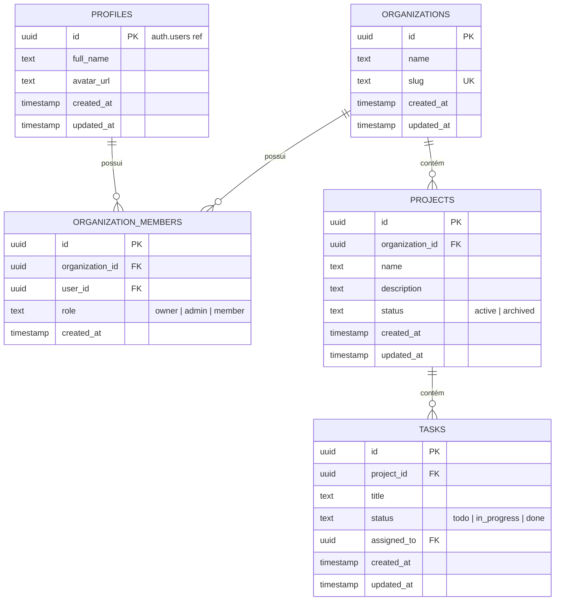

# DATA MODEL

## Entidades Principais (Schema Base)

```mermaid
erDiagram
    PROFILES ||--o{ ORGANIZATION_MEMBERS : "possui"
    ORGANIZATIONS ||--o{ ORGANIZATION_MEMBERS : "possui"
    ORGANIZATIONS ||--o{ PROJECTS : "contém"
    PROJECTS ||--o{ TASKS : "contém"

    PROFILES {
        uuid id PK "auth.users ref"
        text full_name
        text avatar_url
        timestamp created_at
        timestamp updated_at
    }

    ORGANIZATIONS {
        uuid id PK
        text name
        text slug UK
        timestamp created_at
        timestamp updated_at
    }

    ORGANIZATION_MEMBERS {
        uuid id PK
        uuid organization_id FK
        uuid user_id FK
        text role "owner | admin | member"
        timestamp created_at
    }

    PROJECTS {
        uuid id PK
        uuid organization_id FK
        text name
        text description
        text status "active | archived"
        timestamp created_at
        timestamp updated_at
    }

    TASKS {
        uuid id PK
        uuid project_id FK
        text title
        text status "todo | in_progress | done"
        uuid assigned_to FK
        timestamp created_at
        timestamp updated_at
    }
```

## Diretrizes de RLS
- Toda query filtra por `organization_id` onde o usuário atual (`auth.uid()`) é membro ativo em `organization_members`.
